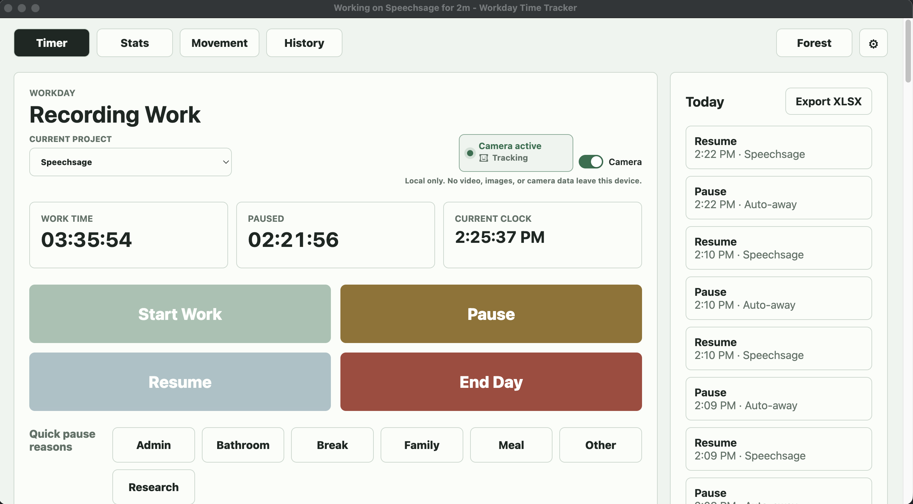
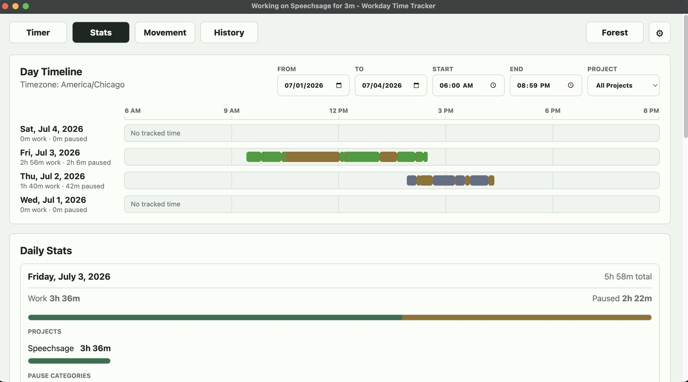
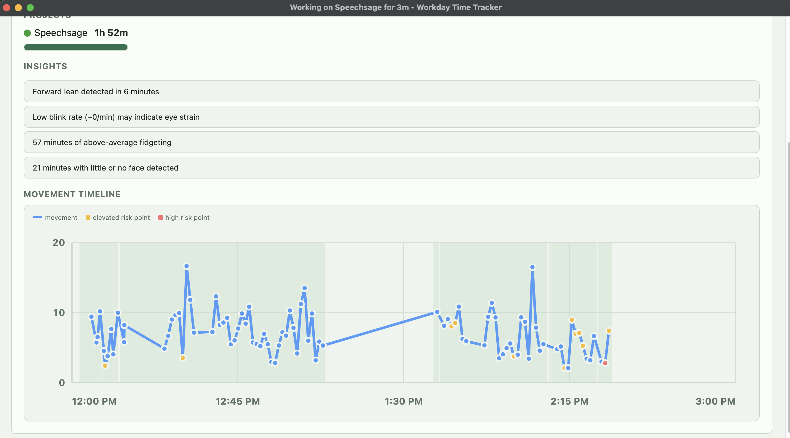
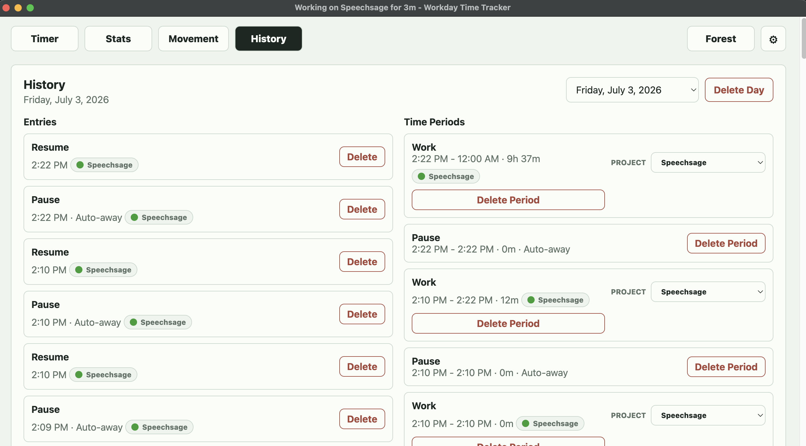
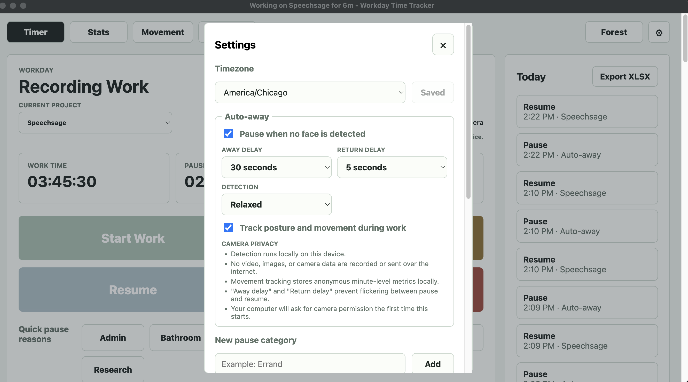
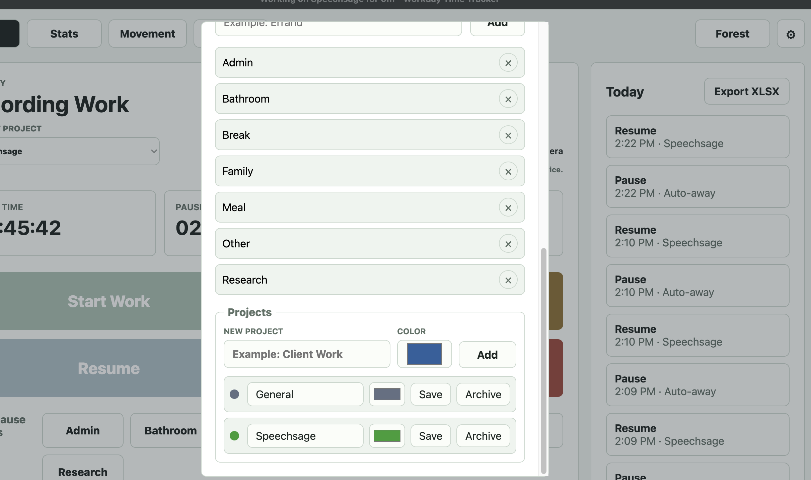
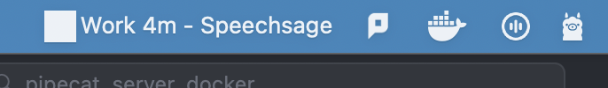

# Workday Time Tracker

Workday Time Tracker is a small desktop app for tracking the shape of a workday: when work starts, when pauses happen, why those pauses happened, and how the day adds up.

It is built for simple, repeated use: large buttons, local storage, quick pause reasons, daily/weekly/monthly stats, and an XLSX export when you want a spreadsheet copy.

## Download

Download the latest unsigned desktop binaries from the GitHub Releases page:

- [Latest release](https://github.com/itsauctions/TimeTracking/releases/latest)
- macOS: download the versioned `Workday-Time-Tracker-*-mac-universal.dmg`
- Windows: download the versioned `Workday-Time-Tracker-*-win-x64.exe`
- Optional checksum files are included as `SHA256SUMS-macOS.txt` and `SHA256SUMS-Windows.txt`

These builds are unsigned. On macOS, you may need to right-click the app and choose **Open**, or approve it in Privacy & Security. On Windows, SmartScreen may warn because the executable is unsigned.

## Screenshots

### Timer

The main timer view shows the active project, camera auto-away status, local camera privacy note, quick pause reasons, and today's recent entries.



### Stats

The Stats page shows day timelines, project-colored work segments, pause time, project totals, and date/time/project filters.



### Movement

The Movement page summarizes posture and movement signals into local-only insights and a timeline for movement, elevated-risk points, and high-risk points.



### History

The History page lets you review entries and time periods, see project assignment badges, reassign work periods, and delete incorrect entries or periods.



### Settings

Camera settings explain that face detection runs locally, no camera data is recorded or sent over the internet, and movement metrics stay local.



Project settings let you add projects, choose colors, rename them, and archive projects without losing historical attribution.



### macOS Menu Bar

The macOS menu bar item shows current work or pause state, elapsed time, and the active project.



## Features

- Start work, pause, resume, and end the day from one screen.
- Track pause reasons such as Bathroom, Family, Break, Admin, Meal, and custom categories.
- Add optional notes to pause or stop events.
- View live work time, pause time, and the current clock.
- Review daily, weekly, and monthly summaries.
- Export an XLSX workbook with raw segments, summary totals, and category summaries.
- Store data locally in SQLite.
- Use the Electron desktop build on macOS or Windows, including a macOS menu bar status item.
- Optionally auto-pause when the local camera no longer detects a large enough face for 15, 30, or 60 seconds.
- Use the newer Tauri desktop build as an alternate Windows packaging path.

## Requirements

All development paths need:

- Node.js LTS
- npm

The recommended Tauri path also needs:

- Rustup/Cargo
- Visual Studio Build Tools with the C++ workload on Windows
- WebView2 Runtime, which is included on current Windows installs

The Electron fallback path also needs:

- Native build tools for `better-sqlite3`
- Windows Node/npm when building directly on Windows
- Xcode Command Line Tools when building the macOS app on macOS

## Getting Started

Clone the repo and install dependencies:

```bash
git clone https://github.com/itsauctions/TimeTracking.git
cd TimeTracking
npm install
```

From there, choose one of the two paths below.

## Path 1: Tauri

Tauri is the recommended path for normal desktop use. It produces a smaller Windows app and starts faster than the Electron version.

Run the app in development:

```bash
npm run tauri:dev
```

Build the Windows app:

```bash
npm run tauri:build
```

Expected Windows build outputs:

```text
dist/tauri/Workday Time Tracker_0.2.0_x64-setup.exe
dist/tauri/workday-time-tracker-0.2.0.exe
```

Use the setup `.exe` for normal installation. The raw `.exe` is useful for quick local testing.

## Path 2: Electron

Electron is the preferred path when you want the macOS app or the older Windows packaging workflow. It uses the same UI and local SQLite data model.

Run the app in development:

```bash
npm start
```

Build a portable Windows executable:

```bash
npm run package:win
```

Build the universal macOS DMG for both Intel and Apple Silicon Macs:

```bash
npm run package:mac
```

On macOS, the Electron app also appears in the upper menu bar with quick timer controls.

If you are packaging from WSL and need to skip Windows executable signing/editing, use:

```bash
npm run package:win:wsl
```

Because `better-sqlite3` is a native module, keep the `postinstall` rebuild step in `package.json`. It rebuilds SQLite for Electron's runtime after install.

## Publishing Downloads

Generated binaries are not tracked in git. Push a version tag to build and publish release assets through GitHub Actions:

```bash
npm version patch
git push origin master --tags
```

The `Release` workflow builds the macOS DMG on `macos-latest` and the Windows portable executable on `windows-latest`, then attaches both to the GitHub Release with SHA-256 checksum files.

The release assets use version-scoped names such as `Workday-Time-Tracker-0.3.3-mac-universal.dmg` and `Workday-Time-Tracker-0.3.3-win-x64.exe`.

## Using The App

1. Click **Start Work** when the workday begins.
2. Click **Pause** or a quick pause reason when stepping away.
3. Click **Resume** when returning to work.
4. Click **End Day** when finished.
5. Open **Stats** to review totals.
6. Click **Export XLSX** to create a spreadsheet copy of the tracked time.

Custom pause categories can be added from the settings button in the app navigation.

The auto-away setting is off by default. When enabled in the Electron app, it uses the local camera and bundled MediaPipe face detector assets to decide whether to add an `Auto-away` pause event. Frames are not saved or uploaded.

## Local Data

The app stores its SQLite database locally as:

```text
workday-time.sqlite
```

In Electron, this lives in Electron's `userData` folder. In Tauri, this lives in the app data directory resolved by Tauri.

Exports are only created when requested. The XLSX export includes:

- `Segments`: raw work and pause segments
- `Summary`: day, week, and month totals
- `Category Summary`: pause totals grouped by category

## Useful Commands

```bash
npm install
npm start
npm run package:mac
npm run tauri:dev
npm run tauri:build
npm run package:win
npm run package:win:wsl
```

Run the Electron SQLite smoke test:

```bash
ELECTRON_RUN_AS_NODE=1 npx electron scripts/db-smoke.js
```

## Troubleshooting

If Electron fails to launch in WSL, install the missing GUI/runtime libraries or run the app from Windows Node/npm instead.

If Tauri build commands fail, confirm that Rustup/Cargo and Visual Studio Build Tools are installed and available in the same shell where you run npm.

If SQLite fails after dependency changes, rerun:

```bash
npm install
```

That triggers the Electron rebuild step for `better-sqlite3`.

## License

MIT. See [LICENSE](LICENSE).
